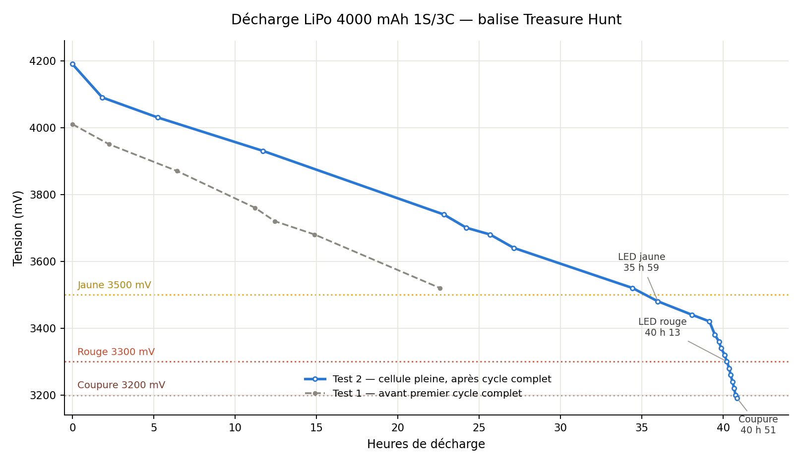

# Battery

**English** · [Français](battery.fr.md)

## Test cell

4000 mAh, 1S, 3C, 3.7 V nominal, 14.8 Wh. LOLIN C3 Pico, advertising at
100 ms, RGB heartbeat, 26 °C ambient, no load beyond the beacon itself.

## Full discharge curve

Two runs on the same cell. Test 1 was its first discharge after purchase;
test 2 followed a full charge/discharge cycle. The 52% gap between them is
the headline result — **size for the first-cycle number if you can only
measure once**, since that is the worst case.

## Timeline, test 2

| Elapsed | Voltage | Event |
|---|---|---|
| 0 | 4190 mV | full charge |
| 5 h 15 | 4030 mV | steep initial phase ends, linear regime begins (~18 mV/h) |
| 35 h 59 | 3480 mV | **LED turns yellow** — `BAT_LOW_MV` (3500 mV) |
| ~39 h 29 | ~3380 mV | discharge knee — rate jumps from ~18 to ~140 mV/h |
| 40 h 13 | 3300 mV | **LED turns red** — `BAT_CRIT_MV` (3300 mV) |
| 40 h 45 | 3200 mV | cutoff threshold crossed |
| 40 h 51 | ~3190 mV | **three slow red flashes, deep sleep** — `BAT_CUTOFF_MV` |

Six minutes between crossing the cutoff threshold and the actual shutdown:
the firmware requires three consecutive low readings, one minute apart,
before it acts — see [troubleshooting](troubleshooting.md) for why.

## Reading this curve

**The linear regime is almost the whole discharge.** On the full-width plot it
looks flat; essentially all of the interesting behaviour — the knee, both LED
colour changes, the cutoff — happens in the last 90 minutes. If you only take
one measurement during a hunt, expect it to land in that long flat middle.

**Segments under about six hours are not reliable**, close to the linear
regime: 10 mV of ADC quantisation dominates the reading at that timescale. In
this data, two consecutive short segments read 28.6 and 13.8 mV/h; combined
they average 21.0, matching the regime either side of them. Trust multi-hour
windows, not single short ones — this cost real time during the test, with
a "knee" announced twice on short segments before the real one showed up
on a six-hour window.

**Do not convert voltage to a percentage.** The relationship is non-linear and
depends on the cell, its age and its chemistry — the whole reason the beacon
advertises millivolts rather than a computed percentage. The useful number is
not "how full is it" but **how long until the next LED colour**, and that is
what this table gives you.

## Sizing

At roughly 40 hours to cutoff, a 4000 mAh cell covers something like a dozen
three-hour hunts. The C3 Pico charges at 500 mA, so refilling an empty cell of
that size takes over eight hours.

A 1000 mAh cell still covers several hunts, recharges in under two hours, and
takes a quarter of the volume — which matters once you are designing an
enclosure meant to hide under a rock. See [hardware](../hardware/README.md)
for the LiPo vs LiFePO4 trade-off.
